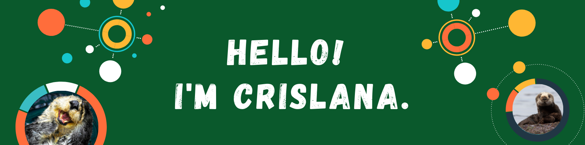

## 👋 About Me:
- [x] Incoming CodePath Android Development Student (Intro to Mobile App Development) at [CodePath](https://codepath.org/) :computer: 
- [x] Current EdTech Fellow (Front-End Development) at [Menon Labs](https://www.menonlabs.com/) :computer: 
- [x] Back-End Developer Fellow at [Technica](https://gotechnica.org/) :computer: 
- [x] Software Engineering student at [Arizona State University](https://www.asu.edu/) **(Go Sun Devils!)** :sunny: 
- [x] Former Applied Science for Engineering Diploma student at [Langara College](https://langara.ca/) **Class of 2021 - Graduation with Distinction**:mortar_board:  
- [x] Sea Otter Enthusiast (Youtube's algorithm knows I like them sea otters) 🦦 

## What I'm currently working on 👩‍💻
- *Landing my first tech internship for Summer 2022 and beyond*  
- Learning Vue, NodeJS, AWS, and DynamoDB as part of my Fellowship with Technica  
- Learning Android app development  
- Learning about APIs with Postman  
- Getting involved with organizing hackathons  
- Computer Vision with Python  
- Learning how to contribute to open source - I'm participating in Hacktoberfest 2021  
- Creating a technical blog - I am currently writing on [CodeNewbie](https://community.codenewbie.org/crislanarafael)  

## Languages and Technologies 💻

## Connect with me at 📬
- [ On my LinkedIn](https://www.linkedin.com/in/crislana-rafael/)
- Random hackathons
- Up in the sky (I am a Private Pilot) :airplane:

<!--
**crislanarafael/crislanarafael** is a ✨ _special_ ✨ repository because its `README.md` (this file) appears on your GitHub profile.

Here are some ideas to get you started:

- 🔭 I’m currently working on ...
- 🌱 I’m currently learning ...
- 👯 I’m looking to collaborate on ...
- 🤔 I’m looking for help with ...
- 💬 Ask me about ...
- 📫 How to reach me: ...
- 😄 Pronouns: ...
- ⚡ Fun fact: ...
-->
